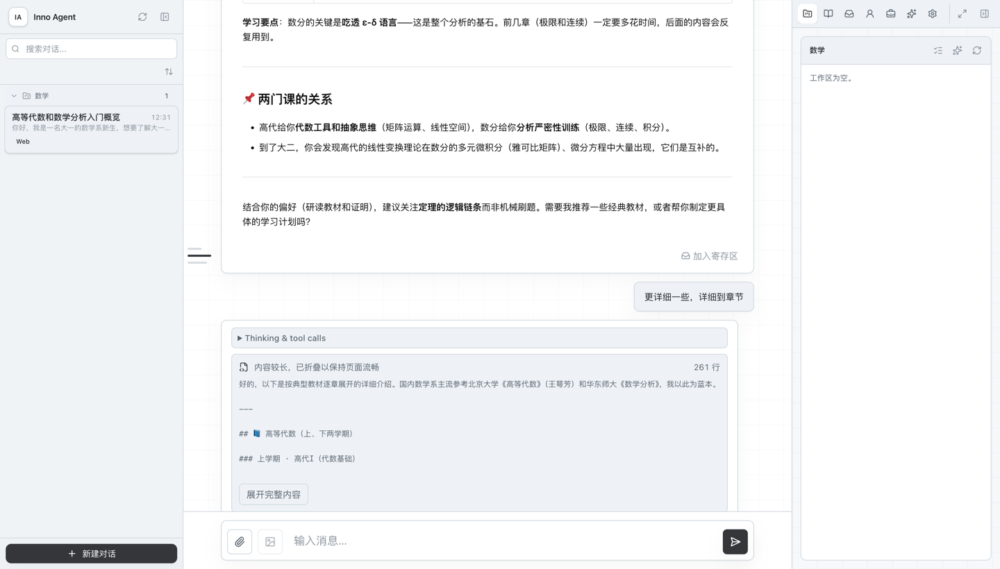

# inno-l2-editor

给 [InnoSpark](https://github.com/hhyqhh/inno-agent) 的 **L2 Wiki 知识库**补一套更好的写入体验：
**AI 负责整理，用户负责决定。**


---

## 解决什么问题

L2 知识库是一堆 Markdown 文件。往里写东西原本只有两条路：

- **让主代理写** —— 改一处要绕几轮对话，还**挤占主代理的上下文**
- **自己改 md** —— 面对没渲染的源码，得懂语法、自己维护 `[[关联]]`

这个项目补中间那一层：**渲染层 + 结构化编辑**，AI 的活挪进独立子代理。

## 三件事

**① 结构化编辑，不碰 YAML。** tag 和「相关知识」点着改，加关联自动双向写入。
md **始终可手改** —— 系统只托管 frontmatter 的 `tags` 和正文里 `## 相关知识` 一段，
其余一个字节都不动。你在 Obsidian 里改完回来，以文件为准。

**② 润色跑在独立会话，工具数为 0。** 它物理上写不了文件，只能提建议；
采用之前正文一个字不变，也不占主代理上下文。

**③ 从资料生成新页，每条都要对得上原文。** 资料先**冻结**（内容寻址 + hash），
子代理产出的每条都附一句原文引文，服务端逐条核对是不是**精确子串**——


核不上的**标红拦下、留在界面上**，不会被悄悄删掉。这是为了回答一个很实际的问题：
**「这条到底是不是它编的？」**

---

## 安装

```bash
git clone https://github.com/netzach-star/inno-l2-editor.git
cd inno-l2-editor
npm install
```

```bash
INNO_AGENT_DIR=/path/to/inno-agent node server.mjs
```

打开 http://localhost:4321 。

`INNO_AGENT_DIR` 指向 InnoSpark 安装目录（有 `restart-dev.sh` 的那一层）。指对了，
编辑的就是它的真实 L2，模型配置也和主代理**同一份**（两边各读各的会出现主代理 401
而这边显示「已配置」的怪事，踩过一次）。

不设也能跑，此时编辑仓库自带的三页示例，左上角橙色标明「非真实库」。

## 装上「对话寄存区」

不装的话，把对话变成 wiki 页只能手动复制粘贴。装上之后 —— 每段 AI 回答下方多一个按钮：



攒够了在右侧「寄存区」点「开始总结」，自动送到编辑器开始生成：


```bash
./bridge/install.sh /path/to/inno-agent
cd /path/to/inno-agent && ./restart-dev.sh restart --mode prod
```

卸载：`./bridge/install.sh /path/to/inno-agent --uninstall`

脚本**幂等**（装过会跳过）、**可逆**（卸载后 `git status` 逐字节干净）、**不硬来**
（所有改动先算完，任一锚点对不上就中止、一个字节都不写，并指明是哪个文件哪段）。
改动量压到最小：新增 2 个文件、改动 5 个。InnoSpark 侧只负责攒和交，
编译、核对、落盘全在这边。

---

## 怎么用

**从对话攒素材** —— 回答下方点「加入寄存区」，该回答连同对应提问一起存下，
以提问前 20 字为题。

**找页面** —— 左侧搜索框搜标题/标签/正文；**点标签**筛出用了这个标签的页；类型药丸筛概念/实体/资料。

**编辑已有页面** —— 左侧选页，右侧改 tag 和「相关知识」，「保存并写回 md」。
页头那条属性条可以直接改 **状态**（draft / reviewed / outdated）与 **可信度**。
正文里打 `[[` 有**页名补全**；`⌘F` / `Ctrl+F` 在本页查找（编辑态也能找到源码里的内容）；
`⌘Z` / `Ctrl+Z` 撤销，**连改标签、改关联这些面板操作一起管**。
正文里手写的 `[[wikilink]]` 也算正式关联，面板中虚线框回显；要删请到正文里删——
系统不替你改写自己的句子。

**看这一页是哪来的** —— 页头「来源」处列出它引用的资料页；
橙色那个「看冻结原文」直接打开**摄入时冻结的那份原始字节**，
并带一行完整性对账（`✓ 与摄入时逐字节一致` / `✗ 原件被改动过`）。
这是红线 1「任何读取都能说明自己的来源」的落地——
你要判断「这条是不是它编的」，看的就是这里。

**谁链向这一页** —— 右侧「被引用」列出反向链接。它是**查询得出的、只读**：
关联只写发起的那一边，不在你这页的正文里塞东西。

**让 AI 润色** —— 编辑态选中一段，按钮或 `⌘K`。默认直接给**改动**（红色删除线是拿掉的、
绿色下划线是新加的），不用自己在两个框里找哪里变了；想看全文点右上角切换。
模型整段重写时会自动退回并排显示并说明原因——那种情况逐字标出来是满屏红绿，没有信息量。

**从资料生成新页** —— 左上「＋ 从资料生成新页」，传 `.md`/`.txt` 或粘贴 AI 的几轮回答，
核对每一条后勾选落盘。

## 核验

**不需要 API key、不需要跑任何服务：**

```bash
node check-citation.mjs      # 35 项：引文定位与来源冻结
node check-frontmatter.mjs   # 40 项：frontmatter 的字节区间写回
node check-math.mjs          # 27 项：公式渲染（定界符、代码块豁免、两条降级路径）
node check-roundtrip.mjs     # 22 项：表格/代码块/图片/公式的存盘往返
node check-editing.mjs       # 55 项：diff 引擎、链接补全、撤销栈
node check-isolation.mjs     #  6 项：子代理隔离
node check-upstream.mjs ../inno-agent   # 抗漂移：锚点还在不在、转发还编不编得过
```

**需要一个在跑的 InnoSpark（会真的写知识库、真的调模型）：**

```bash
node check-pipeline.mjs      # 32 项：写盘边界
INNO_AGENT_DIR=<inno-agent 目录> node check-flow.mjs   # 44 项：真实全流程
node check-upstream.mjs ../inno-agent --full           # 加测端点契约与卸载干净
```

钉住的东西：模型没有正式写权限；引文必须能在冻结来源里定位到；界面可以撒谎、
服务端不信（写盘那侧重新定位）；冻结对账在引文定位**之前**；
只改标签时正文**逐字节**不变；在 A 页加关联只写 A 一个文件；
编辑保存后 `log.md` 与 `index.md` 一个字节都不动；
表格 / 代码块 / 图片 / 公式**存盘往返后源码逐字节不变、渲染结果一致**。

## 环境变量

| 变量 | 作用 |
|---|---|
| `INNO_AGENT_DIR` | InnoSpark 安装目录（推荐，一个顶下面三个） |
| `INNO_WIKI_DIR` | 单独指定 wiki 目录 |
| `INNO_MODEL_CONFIG` | 单独指定模型配置文件 |
| `INNO_API_KEY` | 覆盖配置里的 key，不落任何文件 |
| `INNO_SOURCES_DIR` | 冻结来源存放位置，默认 `./data/sources` |

没装 InnoSpark 又想用 AI：`cp model.config.example.json model.config.json`，填进 apiKey。

## 目录

| | |
|---|---|
| `server.mjs` | HTTP、md 读写、链接解析、图谱构建 |
| `index.html` | 全部前端（无框架、无构建） |
| `polish-agent.mjs` | 子代理：隔离会话、润色、从来源编译 |
| `citation.mjs` | 引文定位 |
| `frontmatter.mjs` | frontmatter 的字节区间读写（只动托管字段） |
| `source-store.mjs` | 来源冻结，内容寻址 + hash 对账 |
| `bridge/` | 装进 InnoSpark 的脚本与源码：寄存区 + 四条转发路由 |
| `sample/wiki/` | 三页示例（自撰常识，不取自任何教材） |

> 源码注释里会出现 `执行决议 D-12` 这样的引用。那是开发期的**内部施工台账**
> （逐条记「当时为什么这么做、踩了什么坑」），**不随发布包分发**。
> 看到 `D-xx` 只需知道：那一行背后有一个想清楚过的决定，不是随手写的。

## 和 InnoSpark 的关系

刻意独立：独立进程、独立端口，视图层另写一套而不复用它的组件。代价是有重复，
收益是它内部结构变了这边不用跟着改 —— 耦合面只有两处：**来源摄入**与**读写 L2**。

上游行为一律以其源码为准。链接解析与图谱构建移植自 `wiki-links.ts` / `wiki-graph.ts`，
引文规范化移植自 `canonical.ts`，两边不各写一套。

> 一处有意的偏离：引文规范化多了「去掉两个中日韩字符之间的空白」。上游那套为空格分词
> 语言设计，中文在句子中间换行会多出一个空格，导致**合法引用**匹配失败。该步骤只动空白、
> 不删实体字符，跨段拼接照样拦得住（`check-citation.mjs` 有断言）。

## 已知边界

不做：Git 式三方合并、多用户实时协作、任意 Markdown 全量反向解析、语义关系类型与方向、
学习路径推理、图谱画布编辑、PDF 直接解析（当前支持 `.md` / `.txt`）。

**正文渲染用 `marked`** —— 和 InnoSpark 自带的笔记本视图是同一个编译器（它经 mini-lit 用它），
所以表格、围栏代码块、图片、普通链接、引用块、任务列表、公式两边表现一致。
`marked` 与 `katex` 都是 `optionalDependencies`：**没装也能跑**，
只是正文退化成纯段落 / 公式原样显示。

### 已知限制（如实写在这里，不藏）

**一、改标题之后 `index.md` 会短暂指着旧标题。**
编辑保存只做 `writeText` + `indexPageByPath`，**不补** `rebuildIndex` 与 `appendLog`——
上游自己的笔记本编辑就是这么保存的，补了反而是偏离。代价是 `index.md`（主代理每次
`l2_query` 都会读的那份目录）会短暂过期，它会在**下一次任何归档**时由上游扫盘自愈。

**二、上游没在跑的时候不能保存。**
所有写入都转发给 InnoSpark——只有让"读盘比对 + 写入"发生在同一个进程的同一次请求里，
乐观锁才关得死。插件自己"先算 hash 再写"只是把冲突窗口从几分钟缩到几十毫秒，没关死，
而一条关不死的护栏被叫做乐观锁就是在骗人。所以上游没起来时如实报"保存不可用"，
**不降级偷偷直写文件**。改动还在编辑器里，不会丢。

**三、搜索的相关性排序照抄上游，可能把精确命中排得很后。**
上游把中文按 bigram 切开再 OR 连接，「数学」这类高频片段会让大量页面成为候选。
所以这边另做了一遍**精确子串**扫描并置顶，界面上标「精确匹配」与「相关」分开显示。
这两类不要混着看。

**四、`bridge/` 是有版本的，卸载必须用当初装它的那一版脚本。**
锚点在版本之间会收窄或改写。拿新版脚本去卸旧版装上去的东西会失败——
好消息是它**在写盘前就会中止**，不会留下半成品。装错版本时脚本会明确告诉你该怎么办。

> **上游动得比想象中快。** 2026-08-19 上游还好好的，08-20 一次
> 「split chat modules」重构就把消息列表挪了个文件，v2.0.0 的 bridge 当场装不上。
> **装之前先跑一次抗漂移自检**，它的输出直接就是修复清单：
>
> ```bash
> node check-upstream.mjs <inno-agent 目录>
> ```
>
> 锚点是按**内容**匹配的，所以上游重构时它顶多"找不到"并中止，
> **不会静默错配、不会写坏你的上游**。

**五、删除不可撤销，但有回收站。**
删除前会把原始字节抄进 `data/.trash/`（插件自己的目录，不在上游扫描范围内）。
界面上没有一键恢复——恢复等于重新建页，得走归档那条链路。`GET /api/trash` 列清单。

**六、`summary` 没有引文出处。**
它绕开引文定位直接写进页面，所以界面上标着「AI 概括，未逐句溯源」并单独配色。
存盘前请自己过一眼。

**七、「定位」不等于「核实」。**
引文定位能证明的只有"这段引文在冻结来源里逐字找得到"，它**不保证**这句话确实被那段
原文支持——那是语义判断，机器做不了。所以字段叫 `anchor` 不叫 `verified`，
界面写「已定位到出处」不写「已核验」。

**八、图片语法能渲染，但知识库里的本地图片还显示不出来。**
`` 会正确渲染成 ``，外链图片能显示；但**相对路径是相对编辑器的源**
解析的，而这个服务只伺服 `index.html` 与 `/vendor/*`，不伺服知识库目录里的资源文件，
所以本地图片会 404 显示成裂图。补它要给服务加一条静态资源路由，**还没做**。
说成"图片支持了"是不准确的，准确的说法就是这一段。

**九、行内的单个 `$` 不当公式。**
`\(…\)`、`\[…\]`、`$$…$$` 三种定界符都认，**单个 `$…$` 刻意不认**——
中文正文里「价格 $100 到 $200」会被吃成一条公式，误报比漏报烦人。
取样数据支持这个取舍：真实回答里 `$…$` 共 24 次且集中在 12 条中的 1 条，
而 `\(…\)` 是 208 次 / 9 条。要写行内公式请用 `\(…\)`。

**十、渲染层挡标签，但它不是一个完备的消毒器。**
正文里的 `<tag …>` 会被转义、不进 DOM（代码块内容照样原样保留并转义显示）。
但 HTML 注释 `<!-- -->` 这类形态不在它的匹配里。
这一套**与上游同源、同强度**——我们复用上游的能力，也就一并继承它的边界。

**十一、查找是「本页」查找，撤销是「本页」撤销。**
`⌘F` 只找当前打开这一页；跨页搜索走左上角那个搜索框（复用上游 BM25）。
撤销历史**换页就清空**——不然在 A 页按 ⌘Z 会把 B 页的内容写回来。
撤销的粒度是「一步操作」，连续打字按 700 毫秒合并，不是逐字符。

**十二、链接补全只补已有页名。**
补不出来说明那一页还不存在。照样可以写下去，正文里会留一个幻影链接
（面板里虚线框、正文里点开提示"这一页还不存在"）——**这是设计里就定的行为，不是补全坏了**。

**十三、diff 在相似度低于 40% 时不画。**
模型整段重写时逐字标出来是满屏红绿、没有信息量，所以退回并排显示，
并在界面上**写明为什么**。看到并排不是 diff 坏了。

## 许可

[MIT](LICENSE)，与 InnoSpark 一致。`sample/wiki/` 下的示例为本项目自撰，同样适用 MIT。
你自己知识库里的内容归你，这个工具不对它主张任何权利。
